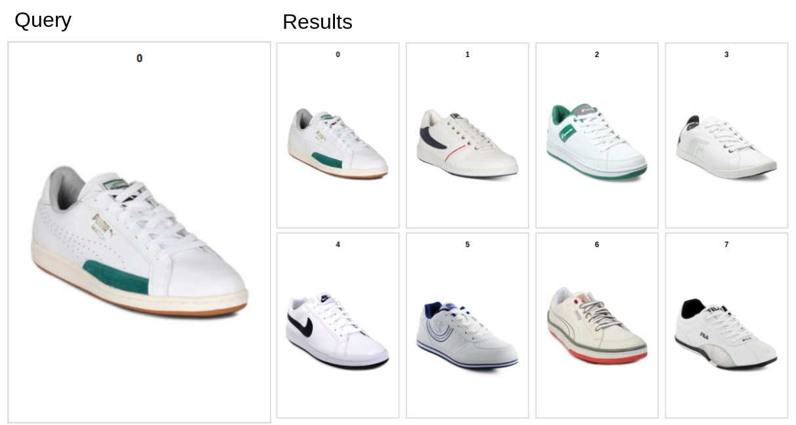
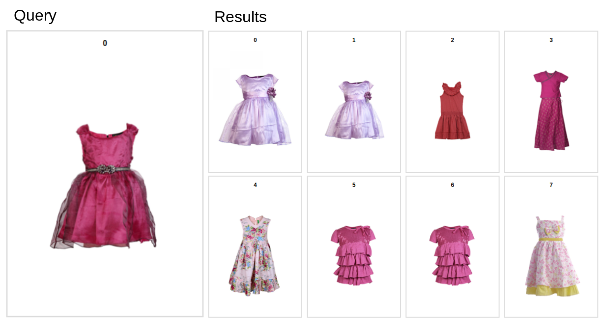

# Visual Search in Rust

Rust web application for visual search. It is a component of [RecoAI](https://recoai.net) which is a fully featured engine
for e-commerce recommendation systems.

Visual Search in Rust is a single responsibility server/library performing similar images queries. It works by 
extracting features using a selected deep learning model and indexing them using an approximate nearest neighbors
algorithm. 

Examples
-----------

Below are examples of search results using a dataset of ecommerce images. Each collection has about 500-600 images.





Features
-----------

- Ability to extract features from any ONNX model (https://github.com/onnx/models/tree/master/vision/classification)
- Image transformation pipeline written fully in Rust
- Supports indexing local image files (bytes) or remote (URL)
- Standalone server for image similarity search (using approximate nearest neighbors algorithm)
- Use as a server or as a library
- Multi-threaded and async indexing
- Python SDK

See example how to use the [SDK](sdk/sdk_example/visual_search_python_sdk_example.ipynb)

How it works
-----------

`visual-search` wraps ONNX format and creates a structure that includes:
- Url of the model (in this case ONNX model from the [Microsoft repository](https://github.com/onnx/models))
- Image transformation pipeline that is necessary to process the image
- Layer name to extract features from (it is almost always last but one layer)

As far as we know this structure should be able to define any model from the ONNX
repository. From the model we extract image features and index them in a predefined
collection of images.

```rust
let model_config = ModelConfig {
    model_name: "SqueezeNet".into(),
    model_url: "https://github.com/onnx/models/raw/master/vision/classification/squeezenet/model/squeezenet1.1-7.onnx".into(),
    image_transformation: TransformationPipeline {
        steps: vec![
            ResizeRGBImageAspectRatio { image_size: ImageSize { width: 224, height: 224 }, scale: 87.5, filter: FilterType::Nearest }.into(),
            CenterCrop { crop_size: ImageSize {width: 224, height: 224} }.into(),
            ToArray {}.into(),
            Normalization { sub: [0.485, 0.456, 0.406], div: [0.229, 0.224, 0.225], zeroone: true }.into(),
            ToTensor {}.into(),
        ]
    },
    image_size: ImageSize { width: 224, height: 224 },
    layer_name: Some("squeezenet0_pool3_fwd".to_string()),
    channels: Channels::CWH
}
```

Installation
-----------

From source:

1. Clone this repository
2. Run `cargo build --release`
3. Run server `target/release/image-embedding-rust --config config/config.toml`

For production remember to change the bearer token in config.toml

Benchmark
-----------

It takes 100 seconds to index 1000 images using MobileNetV2 backbone model using 4 workers.

Searching for a single image takes 150 milliseconds.

Contact
-----------

If you are interested in support please write us an e-mail at pawel(at)logicai.io.

License
-----------

We chose AGPL v3, if you want to use this crate for commercial purposes you must comply
with the license.

To do
-----------

- [ ] persistance (right now the server is fully in-memory)
- [ ] logging
- [ ] clean all warnings
